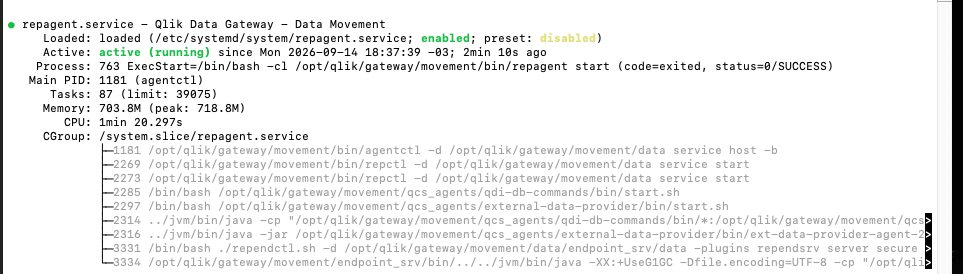
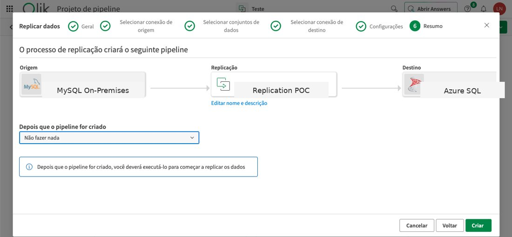
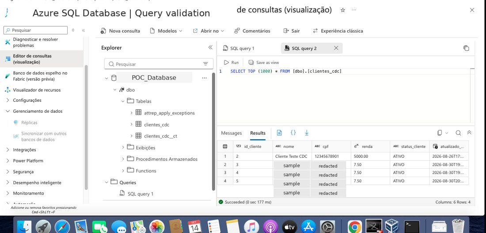

# Qlik Talend Cloud Data Integration POC


> **Portfolio case study based on a real ongoing BI/data integration POC.** Client-specific names, credentials, addresses, infrastructure identifiers, and business data are intentionally omitted or anonymized.

## Overview

This project documents an ongoing **Qlik Talend Cloud (QTC)** proof of concept focused on moving operational data from an **on-premises MySQL database** to target data platforms and progressively validating additional Qlik data integration capabilities.

The first validated flow moved data from **MySQL on-premises** to **Azure SQL Database** using Qlik Talend Cloud Data Movement. The replication design also included **CDC (Change Data Capture)** so changes in the operational source could be propagated incrementally after the initial load instead of requiring a complete reload for every change.

The project is currently moving into its next phase: using **SQL Server as a lower-cost test destination** so pipeline configuration and orchestration can be developed and validated without maintaining the higher-cost cloud alternatives used earlier in the POC.

## Data source — MySQL on-premises

The operational origin of the POC is a **MySQL database hosted in the on-premises environment**. This source feeds the Qlik Data Gateway / Qlik Talend Cloud replication flow.

.jpeg)

The source remains MySQL as the POC evolves from the validated Azure destination toward the SQL Server pipeline-testing phase.

## Phase 1 — Validated milestone

**Data Movement from MySQL on-premises to Azure SQL Database is configured and working.**

```text
MySQL On-Premises
        |
        v
Qlik Data Gateway / VM
        |
        v
Qlik Talend Cloud
        |
        v
Initial Load + CDC
        |
        v
Qlik Data Movement
        |
        v
Azure SQL Database
        |
        v
Data Validation
```

Work completed in this phase includes environment preparation, connectivity configuration, source and target setup, Data Movement execution, CDC/change-replication configuration, validation, and troubleshooting.

### CDC — Change Data Capture

CDC is an important part of the data movement architecture. After the initial dataset is loaded, **Change Data Capture is used to identify and propagate subsequent source changes incrementally** through the replication flow.

For this POC, the portfolio claim is limited to the technical behavior that was configured and validated. No production SLA, latency guarantee, or real-time performance claim is made.

### Evidence — Qlik Data Gateway running



The Qlik Data Gateway service is active in the integration environment, supporting connectivity between the on-premises source and Qlik Talend Cloud.

### Evidence — MySQL → Azure replication flow



The replication flow shows the Phase 1 architecture with **MySQL on-premises as source** and **Azure SQL Database as destination**.

### Evidence — Azure SQL validation



The destination database contains the replicated dataset and the transferred data can be queried successfully.

## Phase 2 — Current test direction

The next implementation phase will keep **MySQL on-premises as the source** and use **SQL Server as the test destination**.

The goal of this change is to continue the POC with a lower-cost destination while advancing into **pipeline configuration, orchestration, transformation, and CDC-oriented replication tests**.

```text
MySQL On-Premises
        |
        v
Qlik Data Gateway / VM
        |
        v
Qlik Talend Cloud
        |
        v
Data Movement / CDC / Pipeline Tests
        |
        v
SQL Server
```

> SQL Server is the destination for the **current/next test phase**. Pipeline functionality will only be marked as implemented after it has been configured and technically validated.

## AWS + Apache Iceberg exploration

An alternative architecture using **AWS with Apache Iceberg** was also configured/explored during the POC.

This path was **not finalized** because continuing the AWS environment would introduce additional infrastructure cost for the proof of concept. It is documented as an explored alternative, not as a completed data movement flow.

The exploration included Qlik Open Lakehouse infrastructure and a **CDC workload**. The supporting evidence includes Qlik Open Lakehouse cluster configuration and AWS network integration accepted in Qlik. See the [Technical Evidence Screenshots](screenshots/README.md) page for the sanitized images.

## Technologies by project stage

### Validated
- **Qlik Talend Cloud (QTC)**
- **Qlik Data Movement**
- **Qlik Data Gateway**
- **CDC (Change Data Capture)**
- **MySQL** — on-premises operational source
- **Azure SQL Database** — validated destination
- **Virtual machine / integration environment**
- Source-to-target connectivity, replication, and validation

### Current / next test phase
- **SQL Server** — lower-cost test destination
- Pipeline configuration and orchestration testing
- Continued CDC / incremental replication testing

### Explored but not finalized
- **AWS**
- **Apache Iceberg**
- **Qlik Open Lakehouse**
- CDC workload on the Open Lakehouse architecture

## Technical evidence

A curated set of real project screenshots was reviewed and selected for public portfolio use. The evidence covers:

- MySQL as the on-premises operational data source
- Qlik Data Gateway running on the integration environment
- MySQL → Azure replication flow in Qlik
- Azure SQL destination validation after replication
- Qlik Open Lakehouse / Apache Iceberg CDC exploration
- AWS network integration accepted in Qlik

Sensitive information such as CPF, AWS account numbers, VPC IDs, internal hostnames, emails, and client-specific identifiers was removed from the prepared public versions where applicable.

[View all technical evidence →](screenshots/README.md)

## Project status

| Stage | Status |
|---|---|
| MySQL on-premises operational source | ✅ Implemented |
| Integration / VM environment preparation | ✅ Implemented |
| Qlik Data Gateway | ✅ Running |
| MySQL source connectivity | ✅ Implemented |
| Azure SQL Database target connectivity | ✅ Implemented |
| Qlik Talend Cloud configuration | ✅ Implemented |
| Initial load / replication setup | ✅ Implemented |
| CDC / incremental change replication | ✅ Implemented / validated in POC |
| MySQL → Azure Data Movement | ✅ Working |
| Data transfer validation in Azure | ✅ Implemented |
| AWS + Apache Iceberg alternative | 🟡 Explored / not finalized due to cost |
| SQL Server as test destination | 🔄 Current next phase |
| Pipeline configuration / orchestration | 🔄 Next implementation milestone |
| Transformations / preparation | ⏳ Planned |
| Data Products | ⏳ Planned |
| Qlik Cloud analytical consumption | ⏳ Planned |
| Qlik Automate | ⏳ Planned |
| Reporting workflows | ⏳ Planned |
| Qlik Answers | ⏳ Planned |

## Repository structure

```text
.
├── README.md
├── PROJECT_SCOPE.md
├── architecture/
│   └── README.md
├── data-movement/
│   └── README.md
├── docs/
│   └── challenges-and-decisions.md
├── infrastructure/
│   └── README.md
├── roadmap/
│   └── README.md
└── screenshots/
    ├── README.md
    └── rc18_portfolio_screenshots_sanitized/
```

## Documentation

- [Verified Project Scope](PROJECT_SCOPE.md)
- [Architecture](architecture/README.md)
- [Infrastructure & Connectivity](infrastructure/README.md)
- [Data Movement](data-movement/README.md)
- [Challenges & Technical Decisions](docs/challenges-and-decisions.md)
- [Project Roadmap](roadmap/README.md)
- [Technical Evidence Screenshots](screenshots/README.md)

## Confidentiality

This repository is a **portfolio representation** of practical work performed in a real project. It does not contain production credentials, IP addresses, server names, customer data, proprietary scripts, confidential screenshots, or internal company documentation.

As the POC progresses, this repository will be updated only with milestones that have actually been implemented and technically validated.
