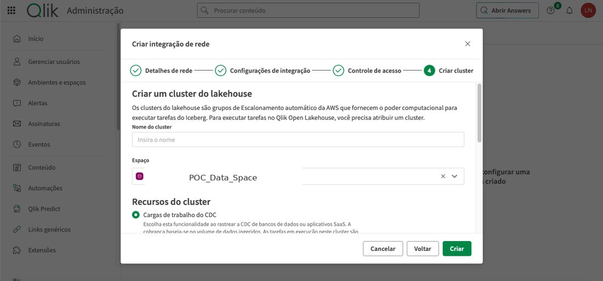
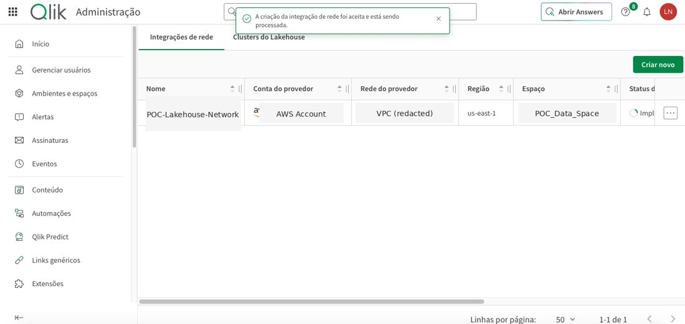

# Technical Evidence Screenshots

This page presents a curated set of **sanitized screenshots from the real project**. The purpose is to provide technical evidence of the implementation while protecting internal infrastructure, account information, personal data, and client-specific identifiers.

## 1. Qlik Data Gateway running


The Linux service for **Qlik Data Gateway – Data Movement** is active and running in the integration environment. This is evidence of the gateway/infrastructure layer used to enable the on-premises data movement scenario.

## 2. MySQL on-premises → Azure SQL replication flow


The Qlik replication flow represents the validated Phase 1 architecture:

```text
MySQL On-Premises → Qlik Talend Cloud / Data Movement → Azure SQL Database
```

Internal connection and project names were replaced with generic portfolio labels.

## 3. Azure SQL target validation


This screenshot shows the destination database after replication, including a successful query against transferred records. Personal/test identifiers were removed from the public version.

Together with the replication flow above, this provides evidence that data reached the Azure SQL destination and could be queried successfully.

## 4. Qlik Open Lakehouse / Apache Iceberg exploration



This screenshot documents the **AWS + Apache Iceberg** architecture exploration using Qlik Open Lakehouse and a CDC workload.

This path was explored and configured during the POC but was **not finalized**, primarily because continuing the AWS infrastructure would add unnecessary cost to the proof of concept.

## 5. AWS network integration accepted in Qlik



This screenshot shows that the AWS network integration configuration was accepted in Qlik during the Open Lakehouse exploration.

AWS account numbers, VPC identifiers, internal data space names, and project-specific identifiers were generalized in the public version.

## What these screenshots prove

The evidence set supports the following project milestones:

- Qlik Data Gateway was configured and running in the integration environment.
- MySQL on-premises was used as the operational source.
- Qlik Talend Cloud / Data Movement was configured for replication.
- Azure SQL Database was used as the validated Phase 1 destination.
- Replicated data was successfully validated in Azure SQL Database.
- AWS network integration and Qlik Open Lakehouse / Apache Iceberg were genuinely explored as an alternative architecture.

## Screenshots intentionally excluded

Some real implementation screenshots were intentionally not published because they expose excessive infrastructure detail with limited additional portfolio value. Examples include raw AWS VPC/subnet pages, KMS key identifiers and ARNs, IAM account/role details, Azure resource screens containing IP addresses or administrator information, and screenshots with internal hostnames or personal/test data.

## Current SQL Server phase

The next architecture phase will use **Microsoft SQL Server as the lower-cost test destination for pipeline development**. Evidence for that phase will only be added after the SQL Server destination and pipeline flow are actually configured and technically validated.

## Sanitization policy

Public screenshots must not expose passwords, API keys, tokens, certificates, project infrastructure IP addresses, AWS account numbers, VPC/subnet IDs, ARNs, KMS identifiers, internal server/database names, email addresses, tenant identifiers, CPF, or confidential customer/business information.
